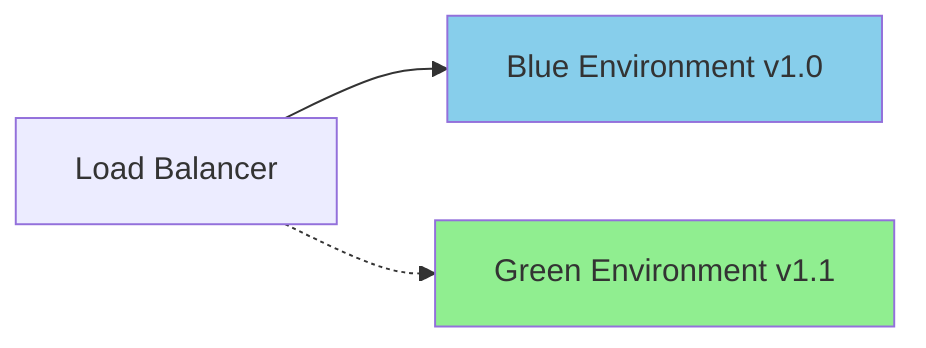

# 🚀 Deployment Strategies for FinTech Systems

## Deployment Patterns

### 1. Blue-Green Deployment
İki identik production ortamı (Blue ve Green) kullanarak sıfır downtime deployment.



**Avantajlar:**
- Anında rollback
- Sıfır downtime
- Production testleri

### 2. Canary Deployment
Yeni versiyonu önce küçük bir kullanıcı grubuna sunma.

**Aşamalar:**
1. %5 trafiği yeni versiyona yönlendir
2. Metrikleri izle (error rate, latency)
3. Sorun yoksa %50'ye çıkar
4. Tüm trafiği yeni versiyona aktar

### 3. Rolling Deployment
Kubernetes ortamında pod'ları sırayla güncelleme.

```yaml
strategy:
  type: RollingUpdate
  rollingUpdate:
    maxSurge: 1
    maxUnavailable: 0
```

## FinTech Özel Gereksinimler

### Database Migration
- **Zero-downtime migrations:** Backward compatible şema değişiklikleri
- **Transaction safety:** Migration sırasında ACID garantisi

### Regulatory Compliance
- **Audit logs:** Her deployment için değişiklik kaydı
- **Rollback plan:** Finansal işlemlerin tutarlılığı için geri alma prosedürü
